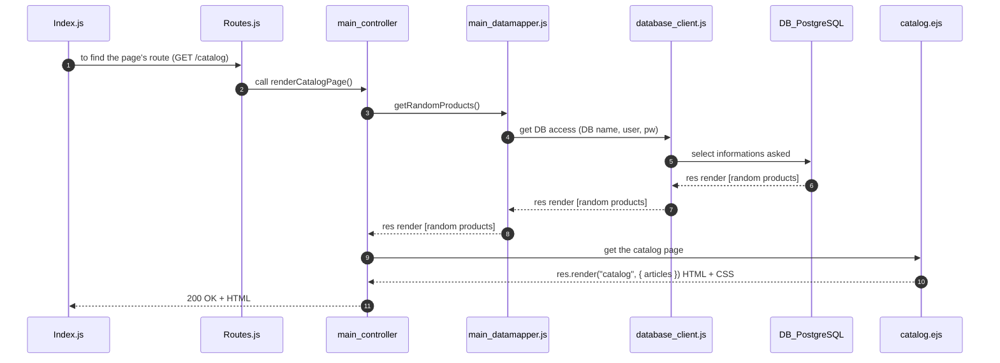

```mermaid
sequenceDiagram
    autonumber
    participant Index as Index.js
    participant Routes as Routes.js
    participant Ctrl as main_controller
    participant DM as main_datamapper.js
    participant Clt as database_client.js
    participant DB as DB_PostgreSQL 
    participant View as catalog.ejs

    Index->>Routes: to find the page's route (GET /catalog)
    Routes->>Ctrl: call renderCatalogPage()
    Ctrl->>DM: getRandomProducts()
    DM->>Clt: get DB access (DB name, user, pw) 
    Clt->>DB: select informations asked
    DB-->>Clt: res render [random products]
    Clt-->>DM: res render [random products]
    DM-->>Ctrl: res render [random products]
    Ctrl->>View: get the catalog page
    View-->>Ctrl: res.render("catalog", { articles }) HTML + CSS
    Ctrl-->>Index: 200 OK + HTML
```